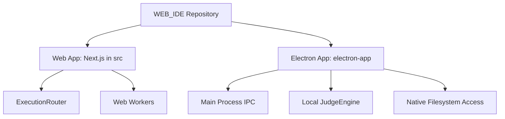
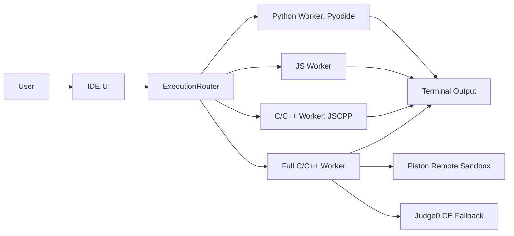
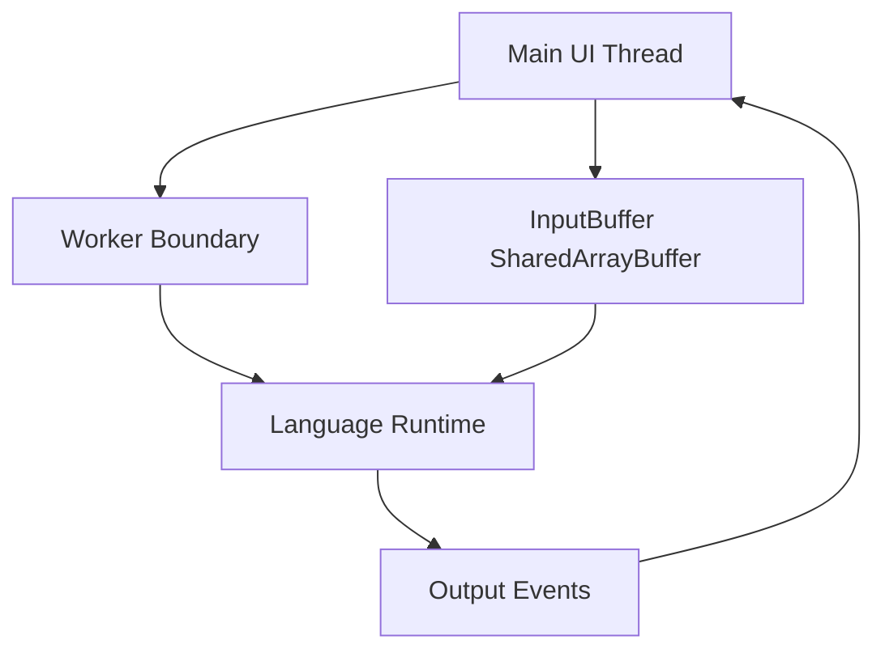
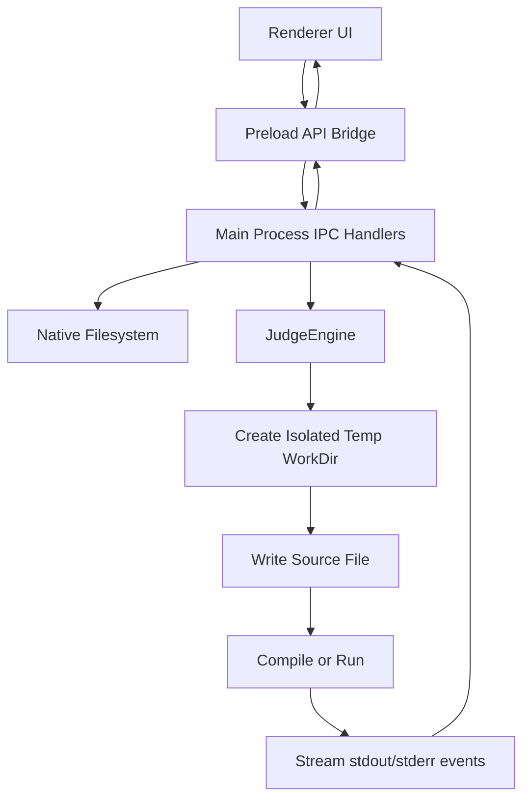
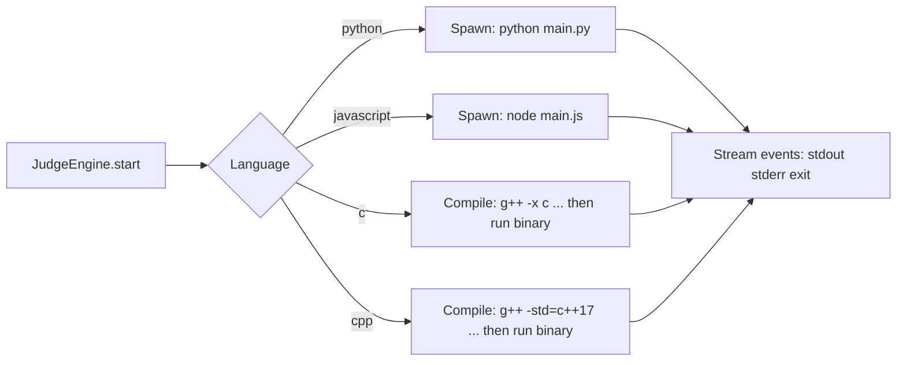
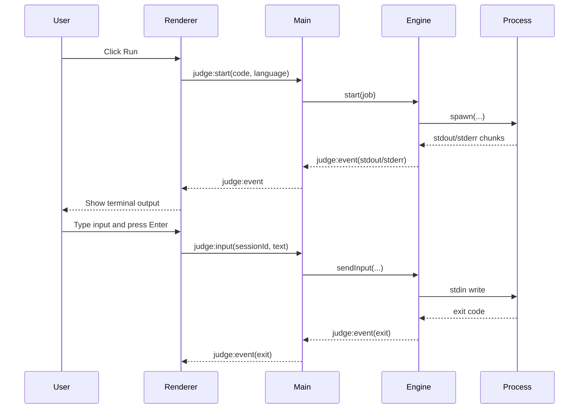
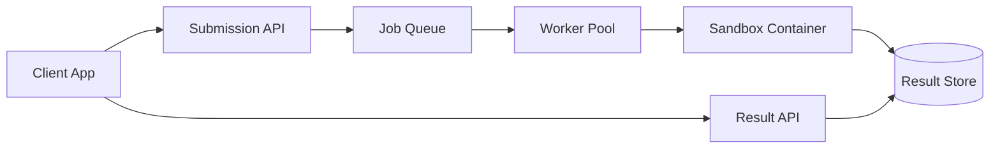
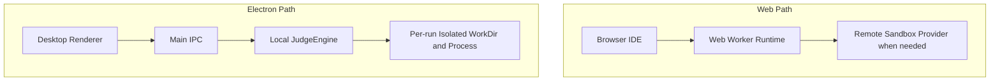

# WebIDE Architecture: Web and Electron

This repository now has two execution products with a shared IDE concept and different runtime models:

1. A web-based IDE built with Next.js and Web Workers.
2. A separate Electron desktop IDE with a local sandbox engine and native filesystem access.

This README describes the current architecture, design decisions, and how it compares with Judge0-style systems.

## Repository Layout

```text
WEB_IDE/
  src/                        # Next.js web IDE
  electron-app/               # Separate Electron desktop app
    engine/judge-engine.js    # Local sandbox engine
    main.js                   # Electron main process and IPC
    preload.js                # Secure bridge to renderer
    src/                      # Desktop IDE UI
```



## Web-Based IDE Architecture

The web app uses a browser-first execution model with worker isolation.

### Runtime Model

1. User writes code in the editor.
2. `ExecutionRouter` resolves language and execution mode.
3. Code is dispatched to a language worker.
4. Worker emits stdout/stderr/system events to the terminal.
5. Input is passed through the shared input buffer when required.

### Current Web Language Paths

- Python: Pyodide worker (`src/workers/python.worker.js`)
- JavaScript/TypeScript: JS worker (`src/workers/js.worker.js`)
- C/C++ quick mode: JSCPP worker (`src/workers/c-cpp.worker.js`)
- C/C++ full mode: remote sandbox fallback provider chain in `src/workers/cpp-full.worker.js`
  - Primary: Piston API
  - Fallback: Judge0 CE API



### Web Isolation and Safety



## Electron Desktop IDE Architecture

The Electron app is intentionally separate from the web app and uses local execution with OS tools.

### Design Goals

1. Keep desktop app independent from web runtime.
2. Use native computer filesystem, not in-memory or browser virtual files only.
3. Provide interactive single-terminal runtime input and output.
4. Support local C, Python, and JavaScript execution in an isolated per-run workspace.

### Desktop Runtime Model



### Engine Execution Paths



### Interactive Single Terminal Flow

The Electron terminal is a single output/input channel:

- Output panel receives streamed stdout/stderr events.
- Input line sends runtime stdin on Enter through IPC.
- Process exit event closes the session state.



## Judge0 Architecture Reference and Comparison

Judge0 is a queue-based online code execution system with API-driven submissions and isolated workers. Our solution borrows key principles and adapts them for two deployment contexts.

### Canonical Judge0-Style Architecture



### Our Adaptation



### Comparison Table

| Dimension | Judge0 | Web IDE Path | Electron Path |
|---|---|---|---|
| Primary deployment | Centralized backend | Browser-first frontend | Desktop application |
| Isolation unit | Container sandbox | Worker + remote sandbox fallback | Per-run local process and temp workdir |
| Queue model | Central queue | Client-side dispatch | Engine-managed active sessions |
| API model | Submission and polling | In-app router and worker messages | IPC handlers between renderer and main |
| Filesystem model | Server ephemeral storage | Browser storage/input buffer | Native filesystem plus isolated temp execution |
| Input model | stdin field per submission | buffer-backed worker input | live runtime stdin via single terminal |

## Why the Overall Solution is Strong

1. Split-by-environment architecture: browser and desktop needs are handled by different runtime models, not forced into one compromise.
2. Progressive execution strategy: quick local worker execution when possible, full remote sandbox fallback for complex web C/C++ cases.
3. Desktop-native capability: Electron app uses native filesystem and local toolchain execution for practical development workflows.
4. Interactive runtime support: single terminal design supports real-time stdin, which is required for many programming problems.
5. Isolation by default: each desktop run uses a unique temporary workspace and process boundary.
6. Extensible design: language runtime handlers are modular in both worker-based and engine-based paths.

## Current Technology Map

| Layer | Web App | Electron App |
|---|---|---|
| UI | Next.js + React + Monaco | Renderer HTML/CSS/JS |
| Runtime dispatch | `ExecutionRouter` | `JudgeEngine` via IPC |
| Python | Pyodide worker | local `python` process |
| JavaScript | JS worker | local `node` process |
| C/C++ | JSCPP and remote full mode | local g++ compile and run |
| Input/output | worker messages + input buffer | single terminal stream + runtime stdin |
| Storage | browser-side | native filesystem |

## Running the Projects

### Web App

```bash
npm install
npm run dev
```

### Electron App

```bash
cd electron-app
npm install
npm run start
```

## Notes

1. The Electron app requires local toolchain availability for native execution paths:
   - `python` for Python
   - `node` for JavaScript
   - `g++` for C/C++
2. The web app full C/C++ mode depends on remote sandbox availability.

