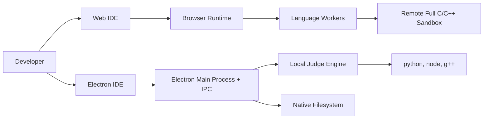
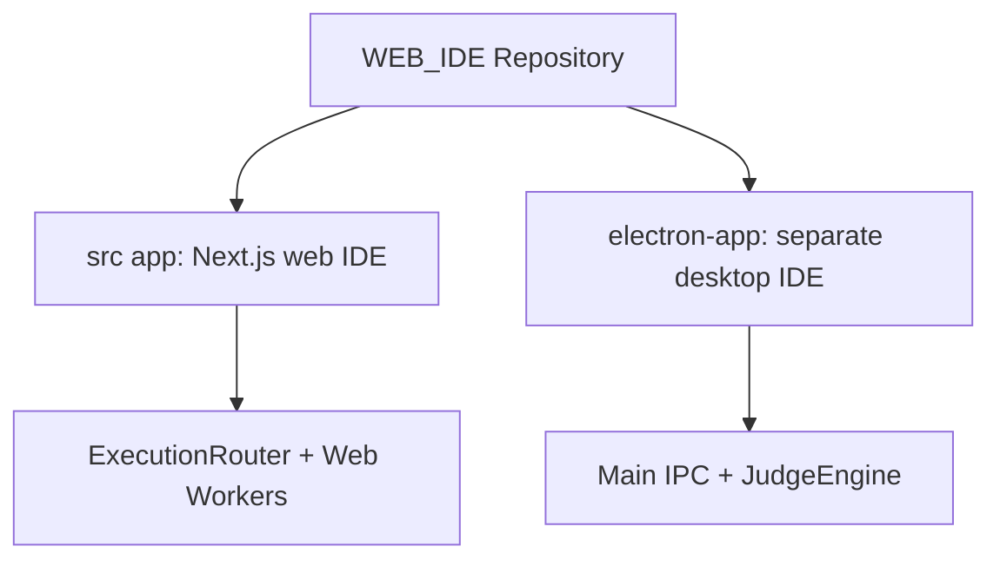
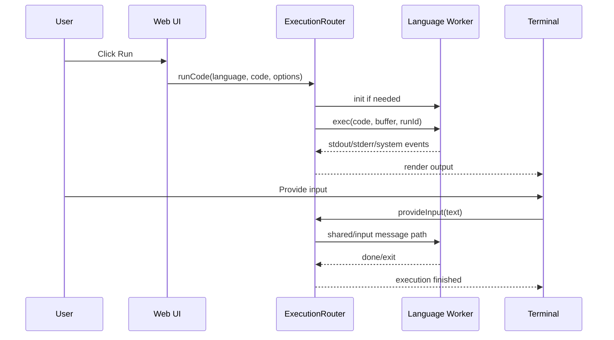
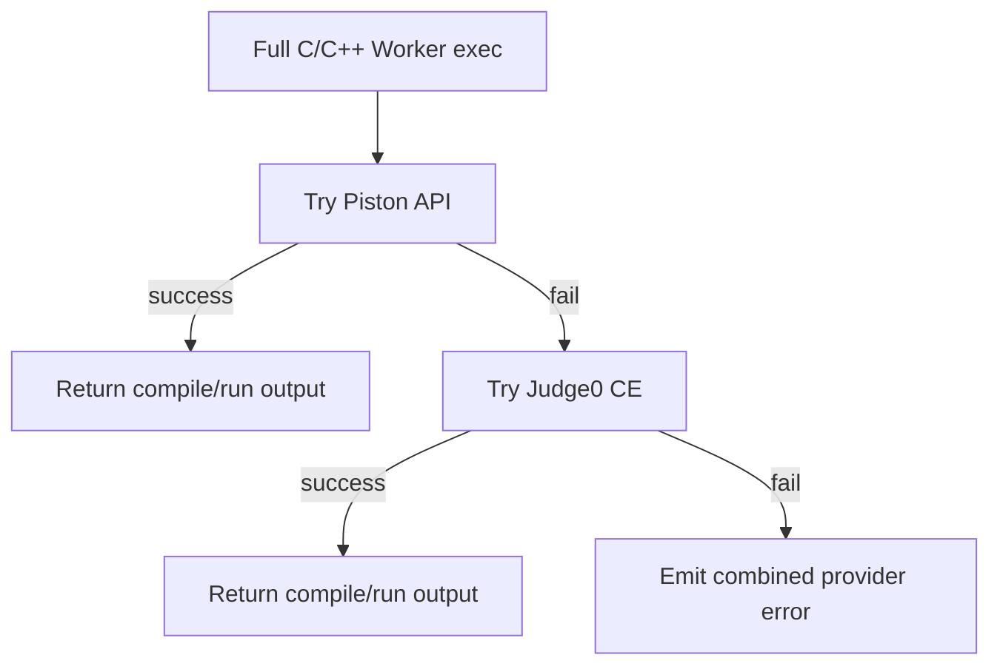
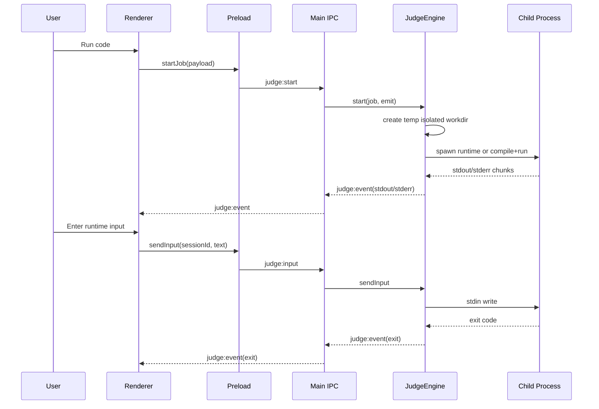
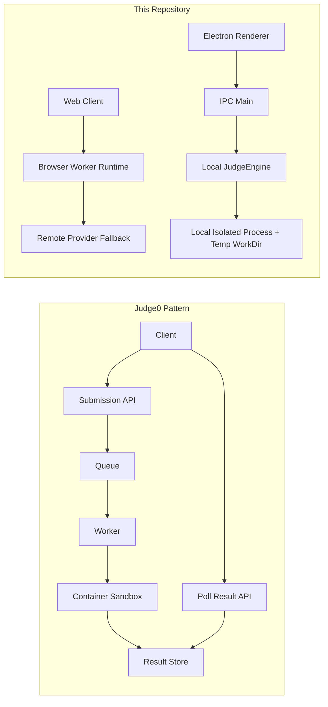

# System Design: HLD and LLD

## Scope
This document describes the current architecture for both products in this repository:

1. Web IDE (Next.js + browser workers)
2. Electron IDE (desktop app + local judge engine)

## 1) High-Level Design (HLD)

### 1.1 Context View


### 1.2 Product Split


### 1.3 Runtime Strategy

1. Web path prioritizes browser execution and worker isolation.
2. Web full C/C++ mode uses remote sandbox providers when needed.
3. Electron path uses local native execution with isolated temporary work directories.
4. Both paths provide interactive terminal-style input/output.

### 1.4 Non-Functional Goals

1. Isolation: language execution separated from main UI thread/process.
2. Responsiveness: output streaming and async execution.
3. Extensibility: language handlers are modular.
4. Portability: web and desktop models can evolve independently.

## 2) Detailed Design (LLD)

## 2.1 Web IDE LLD

### 2.1.1 Main Components

- UI layer in Next.js pages and components
- ExecutionRouter for dispatch and session control
- Worker factory for language worker creation
- Language workers for python, js/ts, sqlite, c/c++, full c++
- Input buffer for synchronous-style stdin bridging

### 2.1.2 Web Execution Flow


### 2.1.3 Web C/C++ Full Mode Provider Chain


### 2.1.4 Web Data Paths

1. Control path: UI -> ExecutionRouter -> Worker messages
2. Output path: Worker events -> ExecutionRouter -> Terminal renderer
3. Input path: Terminal input -> shared buffer/input signal -> worker runtime

## 2.2 Electron IDE LLD

### 2.2.1 Main Components

- Renderer UI with single terminal input/output panel
- Preload bridge exposing controlled IPC methods
- Main process IPC handlers
- JudgeEngine for local sandbox sessions
- Native filesystem access APIs

### 2.2.2 IPC Contract

- workspace:pick -> choose workspace folder
- fs:list -> list directory entries
- fs:read -> read file text
- fs:write -> write file text
- judge:start -> start execution session
- judge:input -> send runtime stdin
- judge:stop -> stop session
- judge:event channel -> streamed stdout/stderr/exit

### 2.2.3 Electron Execution Flow


### 2.2.4 JudgeEngine Language Handlers
```mermaid
flowchart LR
    A[start(job)] --> B{language}
    B -->|python| P[spawn python main.py]
    B -->|javascript| J[spawn node main.js]
    B -->|c| C[compile g++ -x c then run binary]
    B -->|cpp| CPP[compile g++ -std=c++17 then run binary]

    P --> S[session map + event stream]
    J --> S
    C --> S
    CPP --> S
```

### 2.2.5 Session State Model

Each active run keeps:

- sessionId
- language
- workDir (temp sandbox path)
- child process handle
- stdin behavior flags per runtime

Lifecycle:

1. Created at start
2. Receives streamed events while running
3. Accepts runtime input while active
4. On close/error: emits exit, removes session, deletes temp dir

## 2.3 Security and Isolation Notes

### Web

1. Worker boundary isolates runtime from main UI thread.
2. Full C/C++ uses remote provider fallback for browser limitations.
3. Input/output is message-buffer mediated.

### Electron

1. Context isolation enabled with preload bridge.
2. Node integration disabled in renderer.
3. Execution is done in child processes, not in renderer.
4. Per-run temporary directories isolate artifacts and are cleaned after completion.

## 2.4 Reliability and Observability

1. Startup hardening in Electron main process for cache and runtime stability.
2. Streamed event model provides immediate output visibility.
3. Explicit exit events capture termination state.
4. Provider fallback in web full C/C++ mode improves availability.

## 2.5 Comparison to Judge0 Design



Adaptation summary:

1. Queue semantics are local and session-based in Electron.
2. Submission/polling semantics are worker/provider-based in web full mode.
3. Isolation is achieved through worker boundaries and process boundaries depending on platform.

## 2.6 Build and Run Summary

### Web

1. npm install
2. npm run dev

### Electron

1. cd electron-app
2. npm install
3. npm run start

## 2.7 Future Extensions

1. Add concurrent session scheduling policy in Electron engine.
2. Add execution quotas per session.
3. Add persistent run history and replay.
4. Add pluggable remote provider abstraction shared by web and desktop modes.
